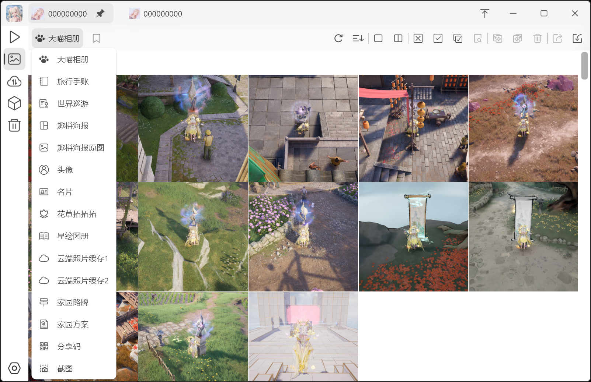
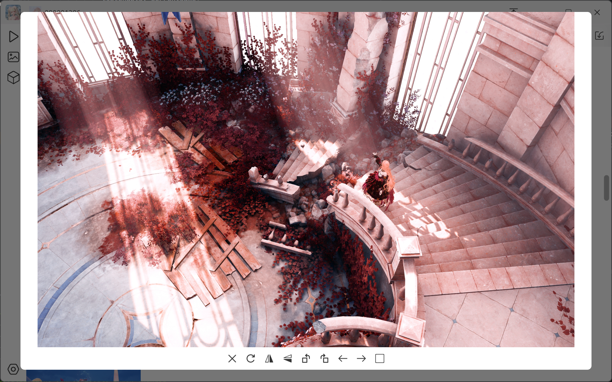

 <a href="README.zh.md">阅读中文版</a>

  
   
  <h1>Nikki Albums</h1>

  
  
  

  

  

  
  

<h2>🌟 Your Ultimate Game Album Management Assistant</h2>

Nikki Albums is a meticulously crafted album management software specifically designed for Infinity Nikki players, dedicated to helping you easily and efficiently manage your game albums for a smoother and more enjoyable gaming experience.

🚀 **Current Version**: 3.03

- **GitHub Download**: [Click Here](https://github.com/RanAxro/nikki_albums )  
- **Official Website**: [Click Here](https://nikki.ranaxro.com )  

💡 **Community/Feedback Group**: 1062670402  
Join us to exchange tips with other players, report issues you encounter during use, and collectively drive software optimization and upgrades.

***

## 🎯 Key Features

- **Automatic Game Detection**: No manual setup required. The software automatically detects your game and quickly locates album content, saving you time and effort.
- **Multi-Account Management**: Easily manage albums for multiple game accounts without interference, keeping each account's album organized.
- **Batch Operations**: Batch process photos in your albums—whether it's backup, restore, transfer, delete, copy, or cut—all done with one click, significantly improving management efficiency.
- **Smart Duplicate Handling**: Automatically handles duplicate photos saved by the game during transfer or deletion, avoiding redundancy and keeping your albums clean and organized.

---

🎉 **Join us and start your efficient game album management journey for a more wonderful gaming experience!**

***

# Changelog

## v3.03
* 1. New album: "Floral Sketching"
* 2. Added Recycle Bin feature
* 3. Support one-click export/backup of all images
* 4. When exporting images to the internet, recipients can preview/download single images or download all online
* 5. Support downloading images shared by other users
* 6. Support packaging images as ".nikkias" files, which losslessly preserve all information of your images
* 7. Fixed some bugs

## v3.02
* 1. Support adding nicknames to UIDs
* 2. Support adding frequently used accounts to the quick access bar
* 3. Added tagging feature to label images
* 4. Fixed some bugs

## v3.01
* 1. Added scrollbar
* 2. Support viewing albums in ascending or descending order
* 3. When viewing large images, switch to previous/next image using hotkeys
* 4. When viewing large images, click on the image to toggle its selection status
* 5. Added button to toggle window maximization
* 6. Added function to delete custom accounts
* 7. Added update detection feature

## v3.0
* 1. Support viewing more albums
* 2. Option to delete duplicate images when deleting pictures
* 3. Support exporting images to clipboard
* 4. Support sharing images within the same network
* 5. Support drag-and-drop import of images
* 6. Support importing images from clipboard
* 7. Album images categorized by date
* 8. Support for Chinese and English languages
* 9. Support theme customization
* 10. Ability to view some game resources

***

# Legal Notices

* ## About This Tool
  This tool is designed to provide Infinity Nikki enthusiasts with a convenient way to manage game albums, helping users better organize and display in-game pictures and screenshots. This tool is released under the MIT open-source license, and all code is available for review on GitHub.
* ## Open Source License Statement
  This tool is released under the MIT open-source license. See the LICENSE file for details. The original copyright notice is retained in all copies of the software, including source code and documentation. If third-party open-source code is used, its copyright notice will also be preserved.
* ## Image and Logo Usage Statement
  * ### Game Images and Logos
    The [Infinity Nikki] images and logos used in this tool are sourced from [Wuhu Paper Network Technology Co., Ltd.], and are used solely for the display and functional implementation of this game album management tool, not for other commercial purposes. We respect the copyright of [Infinity Nikki]. This tool does not make any unauthorized modifications to or distributions of the game.
  * ### bilibili, Steam, TapTap and Other Logos
    The bilibili, Steam, TapTap and other logos used in this tool are solely for identifying and linking to the respective platforms to facilitate users in finding and accessing related content. We respect the copyright and trademark rights of bilibili, Steam, TapTap and other platforms. The use of these logos in this tool is not officially authorized by them and is solely for identification and linking to the respective platforms.
* ## Third-Party Website Links Statement
  This tool provides links to third-party websites solely for the convenience of users accessing relevant content. The content of these linked websites is the responsibility of their respective owners, and we are not responsible for the content, privacy policies, or practices of these websites. Users accessing these websites do so at their own risk and should ensure their actions comply with relevant laws and regulations. This tool and its developers assume no liability if users suffer any loss or damage from accessing these third-party websites.
* ## Privacy Statement
  We take user privacy and security very seriously. This tool does not collect, store, or share user account information, passwords, or other personal private data in any form. All information entered by users is only used for logging into the respective websites (such as the game official website, bilibili, etc.), and this information is not saved or transmitted to any third-party servers.
* ## Technical Implementation Statement
  This tool interacts directly with target websites through an embedded web browser component. Account and password information entered by users is processed directly on the user's local device and sent to the target website through a secure network connection. We do not intercept, store, or analyze this information at any stage. Since this tool is open-source, all code can be reviewed on GitHub, allowing users to verify that we do not perform any unauthorized data collection or storage operations. The open-source nature ensures code transparency and verifiability.
* ## Security Measures
  We have taken the following measures to protect user privacy and security:
  Local Processing: Account and password information entered by users is processed only on the local device and is not sent to any third-party servers.
  Encrypted Transmission: All communication with target websites is conducted through encrypted HTTPS protocol to ensure the security of data transmission.
  Code Review: We welcome community members to review the code to ensure there are no potential privacy issues.
* ## Compliance Statement
  This tool is designed to provide game enthusiasts with a convenient game album management tool. We explicitly state that this tool does not make any form of modifications to the game, including but not limited to modifying game files, injecting code, or tampering with game data. This tool is intended solely for legitimate, non-commercial game album management purposes.
* ## User Conduct Responsibility Statement
  Users should ensure their use of this tool complies with the game's terms of service and relevant laws and regulations. If a user's game account is banned or suffers other losses due to modifying game files, using cheats, or other unauthorized activities, this tool and its developers assume no responsibility. Users bear all consequences resulting from their own actions.
* ## Development Purpose Statement
  The purpose of developing this tool is to provide convenient game album management functionality, helping users better organize and display in-game pictures and screenshots. We do not encourage or support any form of game cheating or violations. When using this tool, users should comply with the official rules and terms of service of the game.
* ## Disclaimer
  This tool and its developers are not liable for any direct or indirect losses that may result from the use of this tool. By using this tool, users agree to and accept the above statements and disclaimer. This tool is not an official product of Infinity Nikki, Paper Games, bilibili, Steam, or TapTap.