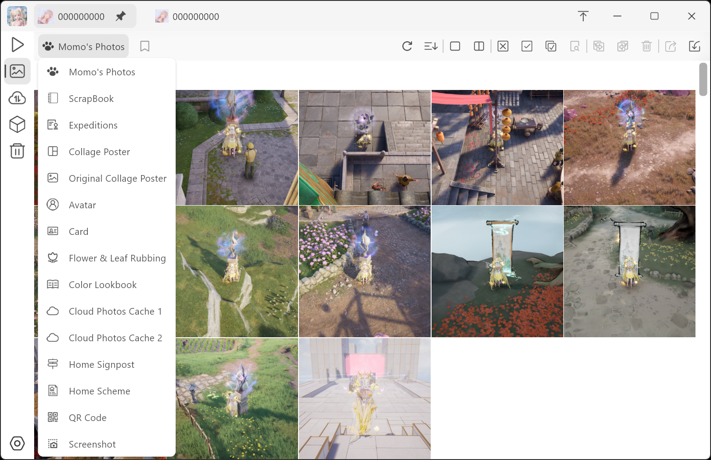
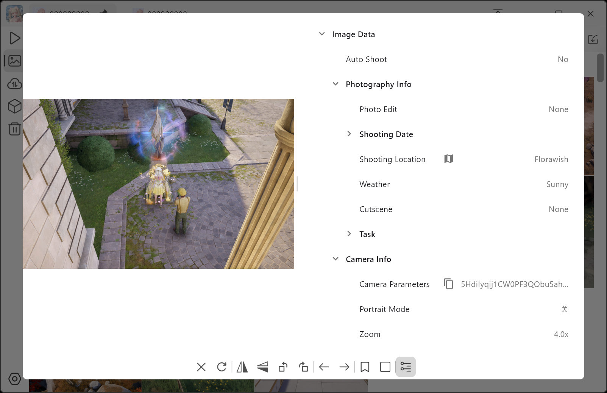

<a href="README.zh.md">阅读中文版本</a>

  
   
  <h1>Nikki Albums</h1>

  
  
  

  

  

  
  

<h2>🌟 A Powerful Assistant for Game Album Management</h2>

Nikki Albums is a meticulously crafted album management software designed specifically for *Infinity Nikki* players. It is committed to helping you easily and efficiently manage your game albums, making your gaming experience smoother and more enjoyable.

🚀 **Current Version**: 3.07

- **GitHub Download**: [Click here](https://github.com/RanAxro/nikki_albums)  
- **Official Website Download**: [Click here](https://nikki.ranaxro.com)  

💡 **Community / Bug Feedback Group**: 1062670402  
Join us to exchange usage tips with other players, report issues encountered during use, and collectively drive the optimization and upgrading of the software.

***

# 🎯 Feature Highlights

- **Auto-detect Game**: No manual setup required; the software automatically detects your game and quickly locates album content.
- **Multi-Account Management**: Easily manage albums for multiple game accounts without interference, keeping every account's album organized.
- **Support All Albums**: 19 albums and 3 game resource albums.
- **Batch Operations**: Batch process photos in albums with one-click backup, restore, transfer, delete, copy, and move, significantly improving management efficiency.
- **Smart Duplicate Handling**: Automatically handles duplicate photos saved by the game during transfer or deletion, avoiding redundancy and keeping albums clean and organized.
- **Simple Editing**: Supports simple image cropping and color adjustment.
- **Export via Network**: Allows transferring images over the same network.
- **Convert to Live Photos/GIFs**: Supports converting videos from "Dynamic Albums" or "External Videos" into Live Photos (Android/Apple format) or GIF animations.
- **Album Decoding**: View shooting locations and copy camera parameters to easily recreate beautiful photos you've taken.

---

🎉 **Join us and start your efficient game album management journey, making your gaming experience even more wonderful!**

***

# Changelog

## v3.07
* macOS support
* Global server support, automatically detects global server albums
* Live Photo conversion, convert "Dynamic Albums" into Motion Photo or Live Photo (macOS only)
* Performance optimization, 92% improvement in filtering performance
* More filter options, added filters for "Completed Photo Missions", "Incomplete Photo Missions", "Perspective Photography", "Thrilling Photography", and "Photo Wall"
* Full parameter decoding
* Mount parameter decoding
* Optimized parameter display position, moving less important parameters to the end
* Added keyboard shortcuts for common functions
* Album position cache, preventing the page from jumping back to the top after refresh, move, delete, or import operations
* Fixed Windows white screen bug on application startup
* Added nikkias configuration item in settings
* Added system theme following feature
* Fixed bug where language was always Chinese on application startup

***

# Declarations

## I. About This Tool

This tool aims to provide convenient game album management functionality for *Infinity Nikki* enthusiasts, helping users better organize and display in-game pictures and screenshots. This tool adopts the MIT open-source license, and all code is available on GitHub.

## II. Open Source License Declaration

This tool adopts the MIT open-source license. See the LICENSE file for details. The original copyright notice is retained in all copies of the software (including source code, documentation, etc.). If third-party open-source code is used, its copyright notice is also retained.

**Exception Declaration**: To prevent malicious use, decryption algorithms related to the game are not open-sourced. This part of the algorithm is provided in compiled binary form and is not included in the public repository.

## III. Intellectual Property Declaration

### 3.1 Game Assets
The *Infinity Nikki* images, game maps, and logos used in this tool are sourced from Wuhu Paper Games Network Technology Co., Ltd. and are used only for the display and functional implementation of this game album management tool, not for other commercial purposes.

### 3.2 Third-Party Platform Logos
The bilibili, Steam, TapTap, and other logos used in this tool are solely for identification and linking to the respective platforms, facilitating users to find and access relevant content. We respect the copyright and trademark rights of the above platforms. The use of relevant logos is without official authorization and is limited to identification and linking purposes only.

## IV. Privacy Declaration

This tool does not collect, store, or share users' account information, passwords, or other personal privacy data in any form.

## V. Technical Implementation Declaration

1. **Algorithm Source**: The image decryption algorithm used by this tool was independently derived by the community and machine learning models through cryptanalysis techniques. The analysis objects are game screenshot files (ciphertext) legally exported by users and the users' own UIDs (keys). The developers have never performed reverse engineering, decompilation, or debugging on the *Infinity Nikki* game client.

2. **Algorithm Protection**: To prevent malicious use, decryption algorithms related to the game are not open-sourced and are only provided in compiled binary form. This measure aims to prevent the algorithm from being used to illegally crack game resources, disrupt game balance, or infringe on intellectual property rights.

3. **No Circumvention**: This tool does not involve circumventing or cracking any technical protection measures (TPM). The algorithm derivation is based on the mathematical principles of Ciphertext-Only Attack, which belongs to the public domain of cryptography research.

4. **Data Ownership**: The tool only processes content generated by users themselves (in-game camera parameters) and does not extract, decrypt, or access core game resources (models, textures, storylines, etc.).

## VI. Compliance Declaration

This tool is intended solely for legal, non-commercial game album management purposes and does not modify the game in any form, including but not limited to modifying game files, injecting code, or tampering with game data.

## VII. User Responsibility Declaration

When using this tool, users should ensure that their actions comply with the game's terms of use and relevant laws and regulations. If a user's account is banned or suffers other losses due to self-modifying game files, using cheats, or other unauthorized behaviors, this tool and its developers assume no responsibility. Users shall bear all consequences resulting from their own actions.

## VIII. Development Purpose Declaration

The purpose of developing this tool is solely to provide convenient game album management functionality, helping users better organize and display in-game pictures and screenshots. We do not encourage or support any form of game cheating or violations.

## IX. Compliance Usage Recommendations

- This tool is for personal learning and exchange only; please do not use it for commercial purposes.
- For commercial use, please contact Paper Games for authorization.

## X. Disclaimer

1. This tool and its developers are not responsible for any direct or indirect losses that may arise from users using this tool.
2. By using this tool, users agree to and accept all the above declarations.
3. **This tool is not an official product of *Infinity Nikki*, Paper Games, bilibili, Steam, or TapTap.**